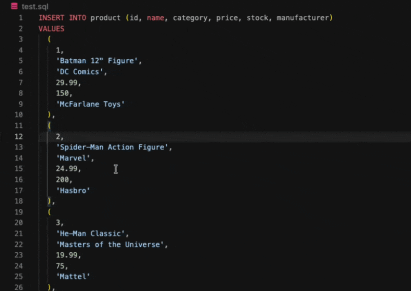

# SQL Insert Editor 

Editing INSERT statements is a nuisance. This VSCode extension is here to help.

## Features

Right-click on a column name or value in INSERT statement to:

- **Move column before**
- **Move column after**
- **Delete column**

It uses a proper [SQL parser](https://github.com/nene/sql-parser-cst)
under the hood to understand and transform the SQL syntax. That's both an upside and a downside.
The downside is that only some SQL dialects are supported.

## Configuration

Make sure to configure your SQL dialect. The extension only works with these select dialects supported by the parser.

- `sqlInsertEditor.dialect` — SQL dialect to use when parsing.
  - `sqlite` (**default**, full support),
  - `bigquery` (full support),
  - `postgresql` (partial support, but pretty good),
  - `mysql` (poorly supported),
  - `mariadb` (poorly supported).

## Publishing

After running `npm run package` you'll get a new `*.vsix` file generated.
Upload that file to VSCode repository at: https://marketplace.visualstudio.com/manage/publishers/renesaarsoo
